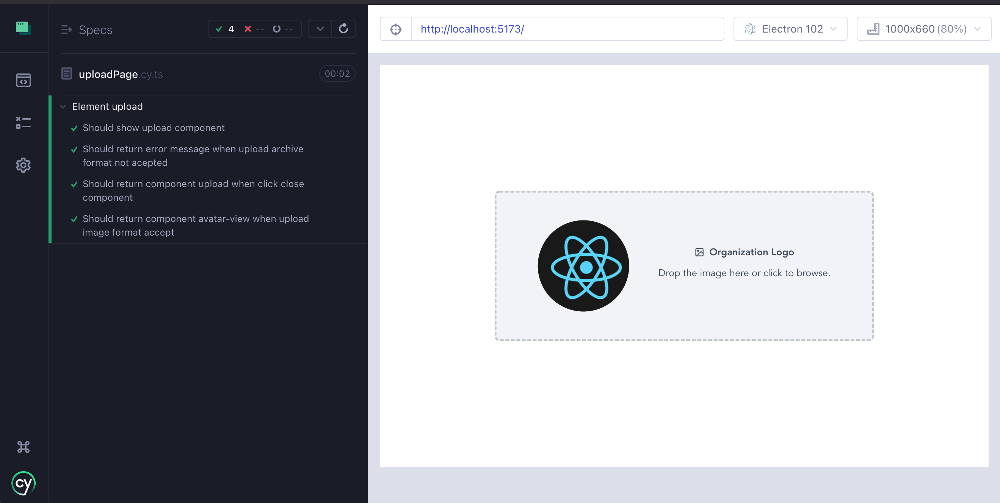
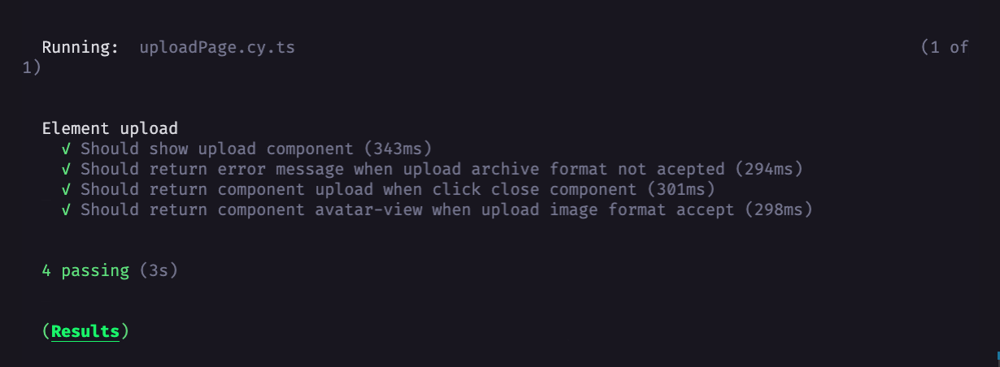
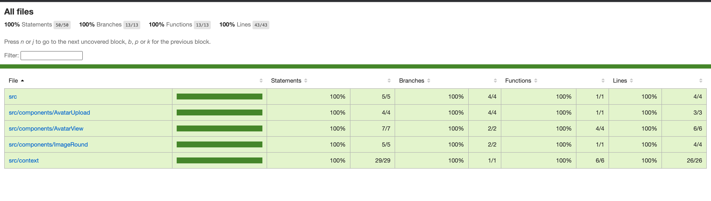

## Application upload image and crop

Simple upload image application

# Get started

### Install dependencies

```bash

yarn

or

npm install

```

### Run application

```bash

yarn dev

or

npm run dev

```


# Tests

Run tests e2e using cypress interface or command line

### Using interface cypress run:

```bash

yarn test:open

or

npm run test:open

```

Opened window cypress interface for view specs test



### Using command line cypress run:

```bash

yarn test

or

npm run test

```

Showed result test in terminal



# Coverage application:


