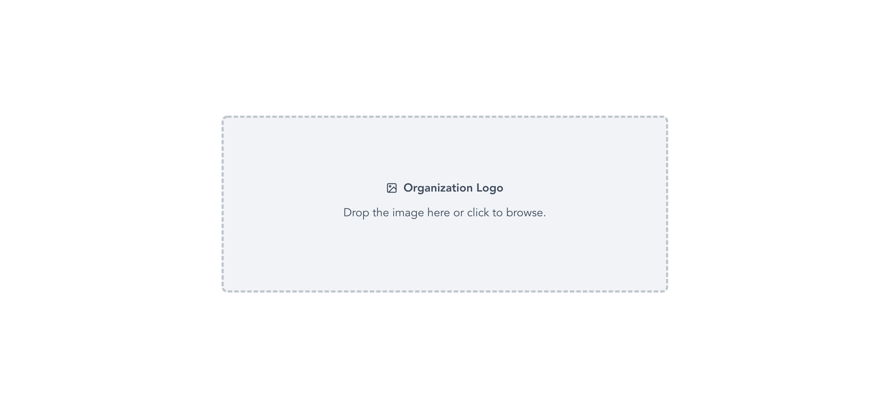

## Application upload image and crop

Simple upload image application

# Get started

### Install dependencies

```bash

yarn

or

npm install

```

### Run application

```bash

yarn dev

or

npm run dev

```


